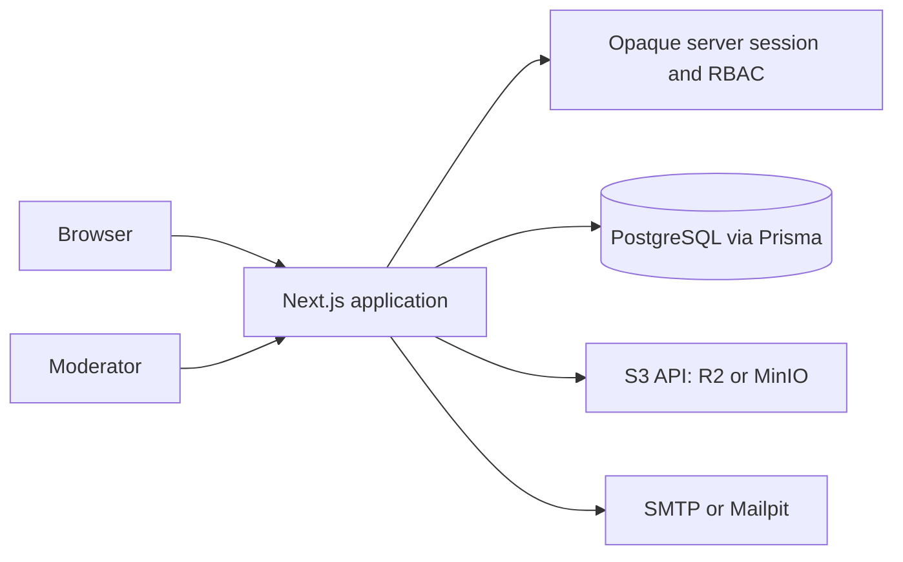

# CampusLink Product Design

**Date:** 2026-07-12  
**Status:** Approved to implement by the user's instruction to continue the full, usable product

## 1. Purpose and boundaries

CampusLink is a trusted single-campus web application. Verified students can share learning resources, post second-hand items and part-time opportunities, favourite useful content, and report unsafe or unsuitable content. Moderators review all submitted content and reports; administrators can manage users and configuration.

The first release is deliberately single-campus. A `Campus` record and `campusId` foreign key are kept from the outset, so the product can later support several campuses without a data migration that changes ownership semantics. The default campus accepts only the configured student e-mail domain.

The supplied Stitch export is a design reference, not application code. It includes home, resource hub, marketplace, recruitment, and report screens. Its Tailwind CDN pages will not be shipped because they have no routing, domain model, authentication, validation, or server-side authorization.

Out of scope for this release: escrow, payments, in-app chat, shipping labels, machine-learning moderation, and multi-campus administration. Marketplace sellers exchange contact details only after the buyer explicitly requests them.

## 2. Product roles and permissions

| Role | Capabilities |
| --- | --- |
| Visitor | Browse published public summaries, search, open sign-in and sign-up pages. No download, favourite, publish, or report action. |
| Student | Verified campus account. Can view/download published resources, create and manage own submissions, favourite, report, and withdraw own pending or published submissions. |
| Moderator | Student permissions plus the moderation queue, report triage, hide/reject/approve actions, and resolution notes. Cannot promote users or change the campus domain. |
| Administrator | Moderator permissions plus user role/status administration, campus configuration, and audit-log browsing. |

Every mutation checks the session on the server. Visibility is a second independent check: authors can read their own draft, pending, rejected, hidden, or archived record; moderators and administrators can read all records; all others only read `PUBLISHED` records.

## 3. Technology architecture

One Next.js App Router repository provides server-rendered pages, accessible React client components, route handlers, server actions, and the administration interface. TypeScript types are shared across UI, validation, database, and test layers.

PostgreSQL is the authoritative transactional store, accessed only through Prisma. Password authentication uses bcrypt and an opaque, server-side database session, not Auth.js credentials. A cryptographically random session token exists only in an `HttpOnly`, `SameSite=Lax`, host-only cookie; production HTTPS uses `__Host-campuslink-session`, while development uses the distinct `campuslink-dev-session`. PostgreSQL stores a SHA-256 hash, expiry, and user reference. Verification uses the same raw-token-at-the-boundary/hash-at-rest approach with a 24-hour expiry and atomic one-time consumption. Production e-mail delivery requires complete SMTP credentials and TLS; when SMTP is deliberately omitted in development, the verification URL is explicitly logged.

Files do not pass through the web server. The application validates a requested file's name, MIME type, size, and content category before minting a short-lived S3-compatible PUT URL. The browser uploads directly to Cloudflare R2 in production or MinIO locally, then calls a completion endpoint which creates the asset record. Random object keys are never derived from a user-controlled filename. Published public files use a download endpoint; non-public files are served only with a short-lived signed URL after an authorization check.

Deployment is a Node-compatible Next.js host such as Vercel, a managed PostgreSQL service such as Neon or Supabase Postgres, Cloudflare R2, and an SMTP provider. Local development uses Docker Compose for PostgreSQL, MinIO, and Mailpit.

## 4. Domain model and invariants

The database has the following aggregates. The actual Prisma schema mirrors these names and enum values.

| Aggregate | Essential fields | Invariants |
| --- | --- | --- |
| `Campus` | `id`, `name`, `slug`, `allowedEmailDomain` | Exactly one active campus is seeded. A sign-up e-mail must end with its normalized domain. |
| `User` | `id`, `campusId`, `email`, `name`, `passwordHash`, `role`, `status`, `emailVerifiedAt` | Pending registrations have a null credential hash; only the verification-link holder supplies a password at activation. `SUSPENDED` users cannot create sessions or mutate content. |
| `Session` | `id`, `sessionTokenHash`, `userId`, `expires` | The random cookie token is never stored; its SHA-256 hash is unique and is revoked on sign-out. |
| `VerificationToken` | `identifier`, `tokenHash`, `expires` | Raw tokens are never stored. One successful verification consumes the token. |
| `RateLimitBucket` | `keyHash`, `windowStartedAt`, `count`, `expiresAt` | Shared PostgreSQL limit bucket with a SHA-256 key hash and expiry cleanup; raw client keys are never stored. |
| `Asset` | `id`, `ownerId`, `storageKey`, `kind`, `contentType`, `sizeBytes`, `status` | A random storage key is unique. Only `READY` assets can attach to a submission. |
| `Resource` | `id`, `authorId`, `campusId`, `title`, `summary`, `courseCode`, `tags`, `status` | Has at least one ready document asset before it may become `PENDING`. |
| `MarketplaceItem` | `id`, `sellerId`, `campusId`, `title`, `description`, `priceCents`, `condition`, `status` | Price is non-negative and has at least one ready image before submission. |
| `JobPost` | `id`, `authorId`, `campusId`, `company`, `title`, `description`, `location`, `payText`, `status` | It uses the same review lifecycle as other submissions. |
| `Favourite` | `userId`, `targetType`, `targetId` | `(userId, targetType, targetId)` is unique; targets must be published. |
| `Report` | `reporterId`, `targetType`, `targetId`, `reason`, `details`, `status`, `assigneeId` | A student has at most one open report for the same target. The reporter cannot report own content. |
| `ModerationAction` | `actorId`, `subjectType`, `subjectId`, `action`, `reason`, `createdAt` | Every moderation decision is immutable and includes a non-empty reason. |
| `AuditLog` | `actorId`, `event`, `entityType`, `entityId`, `metadata`, `createdAt` | Security-relevant changes create a log entry and cannot be edited through the UI. |

Content lifecycle: `DRAFT -> PENDING -> PUBLISHED`, `PENDING -> REJECTED`, and `PUBLISHED -> HIDDEN | ARCHIVED`. Only an author can edit a draft or rejected record; editing a rejected record returns it to draft. Any student can withdraw their own pending or published record, resulting in `ARCHIVED`. A moderator can hide published content immediately and must record a reason.

Report lifecycle: `OPEN -> TRIAGED -> RESOLVED | DISMISSED`. Resolving a report optionally performs a content action. The content action and report resolution are both audit logged.

## 5. Key user journeys

### Registration and sign-in

1. A visitor enters only name and campus e-mail. The server normalizes the address, verifies the campus domain, and writes a credential-free pending account.
2. A verification link containing a one-time, expiring, SHA-256-hashed token is delivered by TLS SMTP. Pending addresses can request a replacement token; an SMTP failure leaves the pending account retryable.
3. The holder of the link chooses and confirms a 12-character password with upper-case, lower-case, number, and symbol. A conditional token delete permits only one concurrent activation, which stores a bcrypt hash and marks the account active.
4. A verified active user signs in with e-mail and password. The server creates an opaque database session, stores only its SHA-256 hash, and sends the random value only in the production `__Host-campuslink-session` HTTPS cookie (or the distinct development cookie). Sign-out revokes the hash.
5. Every state-changing authentication route requires an exact `Origin` match to `APP_URL`, is rate limited by a shared PostgreSQL bucket and normalized e-mail where applicable, and uses forwarded client addresses only with explicit trusted-proxy configuration. Generic failure messages avoid account enumeration.

### Resource publishing

1. A verified student creates a draft with title, description, course code, tags, and a document asset.
2. The client requests an upload intent, uploads the allowed PDF, DOCX, PPTX, XLSX, ZIP, or image directly to storage, and finalizes it.
3. The user submits the completed draft. The server transitions it to `PENDING` only if it owns at least one ready document.
4. A moderator approves with a decision note, making it discoverable and downloadable, or rejects it with actionable feedback.

### Marketplace publishing

1. A verified student enters title, description, price, condition, pickup area, and at least one image.
2. Image uploads follow the same intent/finalize flow and accept JPEG, PNG, WebP, or AVIF only.
3. After moderation approval, the listing appears in the marketplace. A buyer can favourite it and press `Request contact`; the seller's chosen contact field is shown only then and the request is audit logged.

### Reporting and moderation

1. A signed-in user selects a reason and optional explanation from any published record.
2. The server blocks self-reports and duplicate open reports by the same reporter.
3. A moderator sees a queue ordered by severity and age, opens the target and prior actions, and selects dismiss, resolve, hide, or reject with a required reason.
4. The author sees the resulting status and decision note in `My submissions`; the reporter sees a neutral resolved/dismissed outcome without private moderator notes.

## 6. Interfaces and page map

The visual language uses the supplied CampusLink academic blue, energetic green, Inter typography, rounded cards, and content density as a reference. All shipped interactions use semantic HTML, keyboard support, visible focus states, and mobile layouts.

| Route | Purpose |
| --- | --- |
| `/` | Hero search, category entry points, recent approved content, trust explanation. |
| `/resources`, `/marketplace`, `/jobs` | Filterable published listings with pagination and stable URL query parameters. |
| `/resources/[id]`, `/marketplace/[id]`, `/jobs/[id]` | Detail, favourite, report, author metadata, and authorized download/contact actions. |
| `/auth/sign-up`, `/auth/sign-in`, `/auth/verify` | Registration, authentication, and verification flows. |
| `/submit/resource`, `/submit/marketplace`, `/submit/job` | Autosaved draft forms with upload progress and validation summaries. |
| `/me/submissions`, `/me/favourites`, `/me/settings` | User ownership, statuses, favourites, and contact preferences. |
| `/admin/moderation`, `/admin/reports`, `/admin/users`, `/admin/audit-log` | Role-gated operations and history. |

## 7. Upload, privacy, and safety controls

Upload limits are 25 MiB per resource file, 10 MiB per marketplace image, and 8 assets per submission. Resource extensions and content types are allowlisted; marketplace accepts images only. The application rejects SVG, executable formats, HTML, and macro-enabled Office formats. Asset metadata is rechecked when finalizing. Storage CORS permits only the configured site origin and upload methods.

Passwords, verification tokens, session tokens, S3 credentials, SMTP credentials, and the Stitch API key live only in environment or user-level configuration, never in source control. Production requires HTTPS `APP_URL`, `DATABASE_URL` for the shared auth limiter, complete TLS SMTP settings, and an explicit `TRUST_PROXY=true` only behind a proxy that overwrites forwarding headers. Route handlers use Zod schemas, exact-origin checks for mutations, server-side ownership checks, parameterized Prisma queries, rate limiting, and HTML sanitization for rich text-free plain content. User content is rendered as text, not raw HTML.

The first release records an asset's pending scan status and exposes only approved assets. Production operations must connect a malware scanner before accepting public traffic with arbitrary office documents. This deployment dependency is explicit rather than pretending file extension checks provide malware protection.

## 8. Quality strategy and acceptance evidence

Unit tests cover validation, content-state transitions, permission checks, storage-key construction, and duplicate report rules. Integration tests use a disposable PostgreSQL database and MinIO to prove database constraints, session-protected actions, and asset finalization. Playwright runs end-to-end flows for sign-up/verification, sign-in, resource publication, marketplace publication, favourite toggle, report triage, and moderator approval/rejection.

Continuous integration runs format, lint, typecheck, unit tests, integration tests, production build, and Playwright. Docker Compose gives contributors a repeatable local environment. A seed script creates a campus, a verified student, a moderator, an administrator, sample categories, and approved sample listings.

Release is accepted only when all required flows work against the local services, unauthorized actions return an appropriate error, an unverified user cannot publish, hidden content disappears from public search, uploaded files are inaccessible without authorization before publication, and the full test suite passes.

## 9. Stitch MCP integration

The current Codex configuration has no `mcp_servers.stitch` entry. The user-supplied HTTP MCP definition will be added to the user-level Codex configuration after the application baseline is committed. Codex must restart to discover the server tools. The API key is not copied into project files or documentation.

